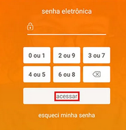

# Sistema de Senha Estilo Itaú

Simulação simples de um sistema de autenticação onde o usuário não digita a senha diretamente, mas escolhe grupos de números, cada grupo contém dois valores (ex: `2 ou 9`), e o sistema valida se o dígito correto da senha está dentro do grupo escolhido.

Projeto simples para praticar lógica de programação, validação de entrada e manipulação de arrays em C.

---

EXEMPLO

# Como rodar
Recomendo compilar no Dev-C++, VSCode (caso ja tenha configurado), ou pelo site [Online C Compiler](https://www.onlinegdb.com/online_c_compiler)
